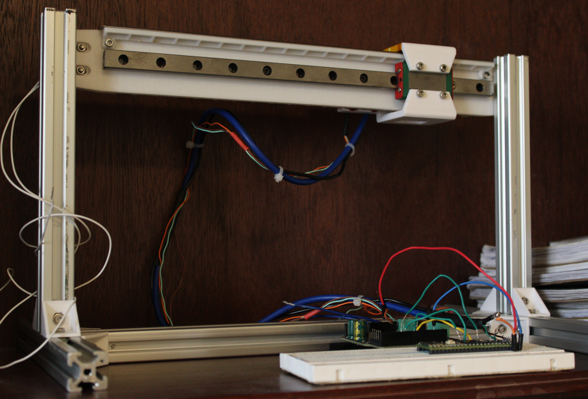
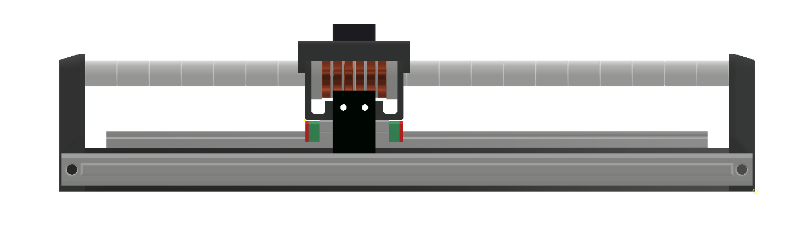

<p align="center">
  
  <br>
  <em> High Performance Low Cost Linear Motors – Designed & built by <a href="https://github.com/wgbowley">William Bowley</a> & <a href="https://github.com/LawsonDG">Lawson Gallup</a> </em>
</p>

---
FDM 3D printers have evolved from commercial to household items, but they still rely on belts and pulleys, which wear out after a few thousand hours of use. Their motion system was perfect for nearly three decades, but micro-stepping can only take us so far. While AC servo motors address the micro-stepping problem, they depend on the same motion system. Furthermore, they cost upwards of 10 to 20 times more while also requiring dedicated driver boards.


## Overview


OpenLSM is a research project striving to produce high-performance linear motors while minimising complexity. The hybrid acronym “OpenLSM” stands for open linear synchronous motors, essentially the same technology used in modern drones and electric vehicles. Linear motors use the same fundamental principles; however, they are built with different geometries to achieve their linear motion.


They should allow for continuous motion at the hardware level, while also having no expandability issues. Whereas for core-xy, it requires approximately 4mm of belt length for every 1 mm of extra travel distance. That leads to harmonic problems, which are resolved with belt tensioning. That ultimately stresses the frame while also wearing down the pulley's teeth. However, it should be emphasized that these longevity issues are mostly a problem for large-format FDM printers. Linear motors avoid these problems due to their reliance on direct motion and minimal mechanical parts. 

## Prototype 0: The curse of blindly following standards

The first prototype demonstrated poor force output with approximately 0.5N at 20W input power. Which is 30 times off the force target. However, it is not all doom and gloom; the general architecture of the “flat” linear motor did work, just very poorly. Even with speculative improvements, it would require ~400W to reach the minimal target force for a single axis. 

<div align="center">
  
</div>


The main insights from this prototype are that the flat linear motor is commercially the standard, but must heavily rely on the usage of laminated silicon steel armatures. They are quite complex to manufacture, hence breaking the project objectives. A new architecture must be explored in the future. Another key insight is that thermal analysis must be considered with magneto analysis. Or risk the coil forms melting during testing again. Hence, a multi-physics approach is required for future design to succeed. Lastly, the high phase resistance led to the motor operating under voltage-limiting conditions, and thus, minimal current could be delivered. 


## Prototype 1: Actual experimentation instead of standards

The current prototype that is being developed is based on work done by cmore839 on his tubular linear motor ([DIY Linear Motor](https://github.com/cmore839/DIY-Linear-Motor)). This motor type is ideal for ironless designs as it geometrically ensures maximal flux usage rather than guiding it with iron. Currently, this prototype is nearly at the stage of building and testing. The main limiting factor is the data board, which should allow for numerical results due to its range of sensors. Specifically, the ADXL345 accelerometer, MAX31885 for thermal data, and the AS5311 magnetic encoder for position data. An automatic coil winder was also developed for this prototype, which enables inductance and resistance matching. Lastly, thermal-magneto axial symmetrical modelling was used to validate this design rather than the TLAR method.




# Credits:

### Research & Development Enabled by:
* [FEMM](https://www.femm.info/wiki/HomePage) - Thank you, Dr. Meeker, for creating FEMM; it was indispensable for prototype 1.
* [SimpleFOC](https://simplefoc.com/) - Thank you, everyone, at simple-foc for developing such a wonderful driver, specifically Runger, for the encoder help.
* Thank you, [Matthew Sorensen](https://sorens.in), for your research into the usage of the AS5311 for 3d printers
* Thank you, [cmore839](https://github.com/cmore839), for your research into tubular linear motors and for creating your very informative Discord server.
* Thank you, [Screbuts @ World of Engineer](https://discord.gg/YFEveHYyeB), for the initial scoping help.


### Bibtex Citation:

```
@misc{Bowley_Gallup_2026,
  author = {Bowley, William and Gallup, Lawson},
  title = {{openLSM}},
  url = {https://github.com/wgbowley/openLSM},
  year = {2026},
  note = {GitHub repository},
  license = {MIT}
}
```
